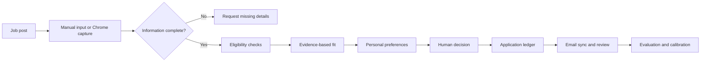

<div align="center">


# JobCraft

### A local-first internship search and decision workspace

Turn job posts, resumes, application history, and personal constraints into an evidence-backed decision trail — without automating away the human decision.

[English](README.md) · [简体中文](README.zh-CN.md)


</div>

> [!IMPORTANT]
> JobCraft is a decision-support tool, not an auto-apply bot. It does not bypass logins, CAPTCHAs, or anti-automation controls, and it never applies or messages recruiters on your behalf.

## Why JobCraft?

Most job-search tools optimize for **more applications**. JobCraft optimizes for **better, explainable decisions**.

It separates four questions that are often mixed together:

1. **Eligibility** — Do you meet the hard requirements?
2. **Capability fit** — What resume evidence matches the role?
3. **Personal preference** — Does the opportunity fit your goals?
4. **Information quality** — Is the job description complete enough to judge?

Only a complete, valid job description can receive a formal score. The model provides evidence and suggestions; you make the final call.

## How it works



## Key features

### Job discovery and capture

- Generate platform-specific search terms and open searches in Google Chrome.
- Capture a job page you are actively viewing with the bundled Chrome extension.
- Support Xiaohongshu, BOSS Zhipin, and Shixiseng workflows.
- Preserve source links, visible page content, screenshots, and your initial judgment.
- Detect duplicate, expired, withdrawn, image-only, and incomplete listings.

### Evidence-based job analysis

- Upload PDF, DOCX, or TXT resumes.
- Extract responsibilities, requirements, application contacts, and eligibility constraints.
- Score six capability dimensions using explicit evidence levels.
- Require every positive score to explain `resume fact → job requirement`.
- Keep hard constraints separate from professional fit.
- Save the resume version, profile version, job description, rules, inputs, and outputs used for each analysis.

### Application materials

- Generate role-specific resume revision suggestions.
- Draft Chinese and English application emails.
- Draft short first-contact messages for BOSS Zhipin.
- Keep generated content grounded in the source resume — no invented projects, skills, metrics, or experience.

### Application ledger and review

- Track application status, next follow-up date, source, resume version, and notes.
- Append status events instead of overwriting history.
- Preserve the highest stage reached even after a rejection.
- Review application, interview, and offer conversion rates.
- Compare outcomes across resume versions.
- Export the application ledger to Excel.

### Optional 163 Mail sync

- Read selected Sent and incoming folders without moving or deleting messages.
- Detect application confirmations, assessments, interviews, rejections, and offers.
- Keep every detected update pending until you confirm it.
- Create a draft email with the selected resume attached; sending remains manual.
- Store authorization codes in macOS Keychain instead of the database.

### Quality evaluation

- Maintain a personal evaluation set for regression checks.
- Measure score-range agreement, eligibility accuracy, gap recall, ranking consistency, and repeat stability.
- Reject placeholder, evidence-free, or structurally invalid model output.
- Keep universal quality rules separate from personal preference calibration.

## Quick start

### Prerequisites

- Python 3.12 or later recommended
- Google Chrome for search launching and the capture extension
- A DeepSeek API key for AI-assisted analysis and material generation
- macOS for Keychain storage and the built-in Chrome launcher

Core data management remains local. Features that explicitly use the model require network access and may incur API charges.

### 1. Clone the repository

```bash
git clone https://github.com/heatherzhu16/Internship-search-assistant.git
cd Internship-search-assistant
```

### 2. Create a virtual environment

```bash
python3 -m venv .venv
source .venv/bin/activate
```

On Windows, activate it with:

```powershell
.venv\Scripts\activate
```

### 3. Install dependencies

```bash
python -m pip install --upgrade pip
pip install -r requirements.txt
```

### 4. Configure DeepSeek

```bash
cp .env.example .env
```

Edit `.env`:

```dotenv
DEEPSEEK_API_KEY=your_api_key
DEEPSEEK_MODEL=deepseek-chat
```

On macOS, you can instead enter the key in JobCraft and save it to Keychain.

### 5. Run JobCraft

```bash
streamlit run streamlit_app.py
```

Open [http://localhost:8501](http://localhost:8501). The local SQLite database and required data directories are created automatically.

## Chrome extension setup

1. Start JobCraft.
2. Open `chrome://extensions` in Google Chrome.
3. Enable **Developer mode**.
4. Select **Load unpacked** and choose `browser_extension/`.
5. In JobCraft, open the job-capture setup area and copy the local pairing token.
6. Save the token in the extension.
7. Open a supported job page and capture it intentionally from the extension popup.

The extension only reads the page you explicitly choose to capture. It does not search, apply, greet recruiters, send messages, like, bookmark, or comment for you.

## Recommended workflow

1. Upload a resume and set a default version.
2. Complete your candidate profile and availability constraints.
3. Capture a job page or paste a complete job description.
4. Review the extracted structure and correct any missing or inaccurate fields.
5. Run the evidence-based analysis and inspect each reason.
6. Record your own decision: prepare to apply, learn more, skip, or request more information.
7. Generate materials, review them manually, and apply outside JobCraft.
8. Update the ledger or confirm detected email events.
9. Use the dashboard and evaluation set to improve future decisions.

## Data and privacy

| Data | Local path | Committed to Git |
|---|---|---|
| Application database | `job_search.db` | No |
| Resume files | `data/resumes/` | No |
| Browser profiles and sessions | `data/browser_profiles/` | No |
| Captured job screenshots | `data/discovery_snapshots/` | No |
| Evaluation cases and reports | `data/evaluation_cases/`, `data/evaluation_reports/` | No |
| Browser pairing token | `data/browser_capture_token.txt` | No |
| API and mail credentials | `.env` or macOS Keychain | No |
| Anonymous demo data | `demo_data.csv` | Yes |

Resume text, the current job description, and relevant confirmed profile fields are sent to the configured DeepSeek API when you request AI analysis. Review the provider's privacy policy before using real personal data.

> [!WARNING]
> Never commit `.env`, `job_search.db`, resumes, browser profiles, screenshots, evaluation reports, or email credentials. The included `.gitignore` excludes these paths by default, but always inspect the staged file list before publishing.

## Project structure

```text
.
├── streamlit_app.py       # Streamlit entry point and navigation
├── app_pages/             # Analysis, materials, ledger, dashboard, and settings pages
├── services/              # Database, scoring, email, resume, and discovery services
├── models/                # Application, resume, discovery, email, and evaluation models
├── browser_extension/     # Local Chrome capture extension
├── static/                # Product logo and icon
├── tests/                 # Automated tests
├── docs/                  # Design and implementation notes
├── demo_data.csv          # Anonymous dashboard demo data
├── requirements.txt       # Runtime dependencies
└── .env.example           # Configuration template
```

## Run tests

`pytest` is kept outside the runtime dependency list. Install it when contributing:

```bash
pip install pytest
pytest -q
```

## Current limitations

- The interface and domain rules currently focus on Chinese internship recruiting.
- Keychain storage and direct Chrome launching are macOS-specific.
- Platform page structures can change and may require capture-rule updates.
- Image-only job descriptions must be transcribed or supplemented before formal scoring.
- Model output is advisory and can be incomplete or incorrect; review it before acting.

## Contributing

Issues and pull requests are welcome. When contributing:

- Never include real resumes, job records, email addresses, credentials, or browser data.
- Add or update tests when changing scoring, eligibility, or data-quality rules.
- Preserve the separation between model suggestions and deterministic local rules.
- Do not add auto-apply behavior or features that bypass platform controls.

## Responsible use

JobCraft is an independent personal project and is not affiliated with Xiaohongshu, BOSS Zhipin, Shixiseng, 163 Mail, DeepSeek, or any employer. Users are responsible for complying with platform terms, local laws, and the privacy expectations of all parties whose data they process.
