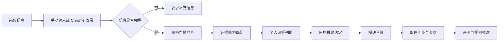

<div align="center">


# JobCraft

### 本地优先的实习求职决策工作台

把岗位信息、个人简历、投递历史和求职条件整理成有证据、可追溯的决策链，同时把最终决定留给用户自己。

[English](README.md) · [简体中文](README.zh-CN.md)


</div>

> [!IMPORTANT]
> JobCraft 是求职决策辅助工具，不是自动投递机器人。它不会绕过登录、验证码或反自动化机制，也不会替你投递岗位或联系招聘者。

## 为什么做 JobCraft？

许多求职工具追求的是**投得更多**，JobCraft 关注的是**判断得更好，而且知道为什么**。

它把经常混在一起的四个问题分开处理：

1. **资格门槛**：学历、专业、到岗时间等硬性条件是否满足？
2. **能力匹配**：简历中有哪些事实能够对应岗位要求？
3. **个人偏好**：这份机会是否符合你的方向、城市和公司偏好？
4. **信息质量**：当前 JD 是否完整、有效并足以判断？

只有完整、有效的岗位描述才能生成正式分数。模型负责提供证据和建议，最终决定仍由用户确认。

## 工作流程



## 核心功能

### 岗位发现与收录

- 根据目标岗位和城市生成平台搜索词，并使用 Google Chrome 打开搜索入口。
- 通过附带的 Chrome 扩展，收录用户当前主动打开的岗位页面。
- 支持小红书、BOSS 直聘和实习僧相关流程。
- 保存来源链接、可见正文、页面截图和用户的初步判断。
- 识别重复、过期、下线、纯图片和信息不完整的岗位。

### 基于证据的岗位分析

- 支持 PDF、DOCX 和 TXT 简历。
- 提取岗位职责、任职要求、投递方式和资格条件。
- 使用明确的证据档位评估六个能力维度。
- 每条正向得分都必须说明“简历事实 → JD 要求”。
- 把学历、专业、到岗和实习时长等硬条件与能力分开判断。
- 保存每次分析所使用的简历版本、档案版本、JD、规则、输入和输出。

### 求职材料生成

- 生成针对具体岗位的简历修改建议。
- 生成中文和英文求职邮件。
- 生成 BOSS 直聘首次沟通短文案。
- 所有内容必须基于原始简历，不得虚构项目、技能、数字或工作经历。

### 投递台账与复盘

- 记录投递状态、下次跟进日期、信息来源、简历版本和备注。
- 使用追加事件保存状态变化，不直接覆盖历史。
- 即使最后被拒，也会保留曾经达到的最高流程阶段。
- 查看投递、面试和 Offer 转化率。
- 比较不同简历版本的实际表现。
- 将投递台账导出为 Excel。

### 可选的 163 邮箱同步

- 只读扫描指定的已发送和收件文件夹，不移动或删除邮件。
- 识别投递确认、笔试测评、面试、拒信和 Offer。
- 所有识别结果默认进入待确认状态。
- 可创建附带指定简历的邮件草稿，发送操作仍需人工完成。
- 授权码可保存在 macOS 钥匙串中，不写入数据库。

### 评分质量评测

- 建立个人评测集，对评分规则进行回归检查。
- 检查分数区间、门槛准确率、缺口召回、排序一致性和重复稳定性。
- 拒绝占位、无证据或结构不合法的模型输出。
- 把通用质量规则与个人偏好校准分开维护。

## 快速开始

### 环境要求

- 推荐 Python 3.12 或更高版本
- Google Chrome，用于打开搜索和安装岗位收录扩展
- DeepSeek API Key，用于 AI 分析和材料生成
- 推荐 macOS：钥匙串保存和内置 Chrome 启动功能目前针对 macOS 实现

核心数据管理默认在本机完成。明确调用模型的功能需要联网，并可能产生 API 费用。

### 1. 克隆项目

```bash
git clone https://github.com/heatherzhu16/Internship-search-assistant.git
cd Internship-search-assistant
```

### 2. 创建虚拟环境

```bash
python3 -m venv .venv
source .venv/bin/activate
```

Windows 用户可以使用：

```powershell
.venv\Scripts\activate
```

### 3. 安装依赖

```bash
python -m pip install --upgrade pip
pip install -r requirements.txt
```

### 4. 配置 DeepSeek

```bash
cp .env.example .env
```

编辑 `.env`：

```dotenv
DEEPSEEK_API_KEY=你的_API_Key
DEEPSEEK_MODEL=deepseek-chat
```

在 macOS 上，也可以直接在 JobCraft 内填写并保存到系统钥匙串。

### 5. 启动 JobCraft

```bash
streamlit run streamlit_app.py
```

打开 [http://localhost:8501](http://localhost:8501)。首次运行会自动创建本地 SQLite 数据库和必要的数据目录。

## 安装 Chrome 扩展

1. 启动 JobCraft。
2. 在 Google Chrome 打开 `chrome://extensions`。
3. 开启“开发者模式”。
4. 点击“加载已解压的扩展程序”，选择 `browser_extension/`。
5. 在 JobCraft 的岗位收录设置区域复制本机配对码。
6. 在扩展中保存配对码。
7. 打开支持的岗位页面，并在扩展弹窗中主动执行收录。

扩展只读取用户明确选择收录的当前页面，不会自动搜索、投递、打招呼、发送消息、点赞、收藏或评论。

## 推荐使用流程

1. 上传简历，命名并设置默认版本。
2. 完成求职档案和可用时间等个人条件。
3. 收录岗位页面，或手动粘贴完整 JD。
4. 检查系统提取的结构，并修正缺失或不准确的字段。
5. 运行证据评分，逐项查看得分与理由。
6. 记录自己的判断：准备投递、继续了解、暂不投递或信息待补全。
7. 生成求职材料，人工复核后在 JobCraft 外完成投递。
8. 更新投递台账，或确认邮件同步识别出的事件。
9. 使用复盘看板和个人评测集持续校准判断规则。

## 数据与隐私

| 数据 | 本地位置 | 是否提交 Git |
|---|---|---|
| 投递数据库 | `job_search.db` | 否 |
| 简历原始文件 | `data/resumes/` | 否 |
| 浏览器登录资料 | `data/browser_profiles/` | 否 |
| 岗位页面截图 | `data/discovery_snapshots/` | 否 |
| 评测案例与报告 | `data/evaluation_cases/`、`data/evaluation_reports/` | 否 |
| 浏览器配对码 | `data/browser_capture_token.txt` | 否 |
| API 与邮箱凭证 | `.env` 或 macOS 钥匙串 | 否 |
| 匿名演示数据 | `demo_data.csv` | 是 |

当用户主动执行 AI 分析时，简历文本、当前 JD 和与该岗位相关的已确认档案字段会发送给配置的 DeepSeek API。使用真实个人信息前，请先阅读模型服务商的隐私政策。

> [!WARNING]
> 不要提交 `.env`、`job_search.db`、真实简历、浏览器登录资料、岗位截图、评测报告或邮箱凭证。项目自带的 `.gitignore` 默认排除了这些路径，但公开前仍应检查实际暂存文件清单。

## 项目结构

```text
.
├── streamlit_app.py       # Streamlit 主入口与导航
├── app_pages/             # 分析、材料、台账、看板和设置页面
├── services/              # 数据库、评分、邮件、简历和岗位服务
├── models/                # 投递、简历、岗位、邮件和评测模型
├── browser_extension/     # 本地 Chrome 岗位收录扩展
├── static/                # 产品 Logo 与图标
├── tests/                 # 自动化测试
├── docs/                  # 设计与实现说明
├── demo_data.csv          # 匿名看板演示数据
├── requirements.txt       # 运行依赖
└── .env.example           # 配置模板
```

## 运行测试

`pytest` 没有放在应用运行依赖中。参与开发时可以单独安装：

```bash
pip install pytest
pytest -q
```

## 当前限制

- 当前界面和领域规则主要面向中文实习招聘场景。
- 钥匙串保存和直接启动 Chrome 的功能依赖 macOS。
- 招聘平台页面结构变化后，收录规则可能需要更新。
- 纯图片 JD 必须转写或补充文字后才能正式评分。
- 模型输出仅供参考，可能不完整或不准确，采取行动前必须人工复核。

## 参与贡献

欢迎提交 Issue 和 Pull Request。参与贡献时请注意：

- 不要包含真实简历、岗位记录、邮箱地址、凭证或浏览器数据。
- 修改评分、门槛或数据质量规则时，请同时补充或更新测试。
- 保持模型建议与本地确定性规则之间的边界。
- 不要加入自动投递或绕过平台限制的功能。

## 负责任使用

JobCraft 是独立的个人项目，与小红书、BOSS 直聘、实习僧、163 邮箱、DeepSeek 或任何雇主均无隶属关系。用户有责任遵守相关平台条款、适用法律，以及所有被处理数据主体的隐私预期。
