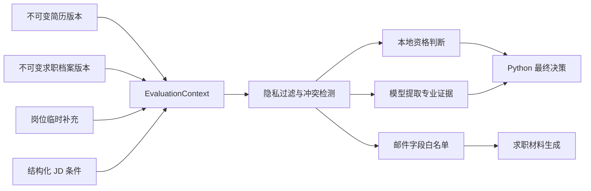

# 候选人上下文层完善方案

## 1. 目标与边界

候选人上下文层负责管理“简历之外、但会影响资格判断和求职沟通”的信息。
它不替代简历，也不能给简历补写经历、项目、技能或成果。

最终评估必须明确区分三类结果：

1. **专业匹配分**：只根据简历证据与 JD 专业要求计算。
2. **资格门槛**：根据已确认档案、本岗位临时补充和 JD 必须条件在本地判断。
3. **最终投递建议**：由 Python 将专业匹配分与资格门槛合并，不由模型自由决定。



## 2. 当前项目完成度

| 能力 | 状态 | 说明 |
|---|---|---|
| 档案与档案版本表 | 已完成 | 使用完整 JSON 快照和内容哈希 |
| 到岗时间、城市、工作方式等档案字段 | 已完成 | 支持多段可用时间 |
| 本岗位临时补充 | 已完成 | 不覆盖默认档案 |
| 评分输入与输出快照 | 已完成 | 已关联档案版本、简历版本和评分版本 |
| 连续时间段资格检查 | 已完成 | 不会把两段不兼容时间拼成满足 |
| 资格门槛正式影响建议 | 已完成 | 不满足强制不建议，存疑最高谨慎 |
| 不可变简历版本与分析历史 | 已完成 | 新评分可以回看当时简历和 JD |
| 多档案创建、切换、归档 | 部分完成 | 数据库支持，页面目前主要使用默认档案 |
| `None`/未知语义 | 部分完成 | 日期和布尔值支持，部分文本仍使用空字符串 |
| 档案过期提醒、时间段重叠警告 | 未完成 | 需要字段级时效规则 |
| 简历与档案冲突检测 | 未完成 | 目前只有固定优先级，没有冲突阻断 |
| 按 JD 最小化发送私人字段 | 未完成 | 当前上下文仍包含与 JD 无关的档案字段 |
| 工作方式、现场天数等完整本地判断 | 部分完成 | 已有类型，但判断覆盖不完整 |
| 邮件字段授权预览 | 未完成 | 偏好已存储，但没有生成前白名单确认 |
| DeepSeek 非法 JSON 容错 | 未完成 | 当前只接受一次严格 JSON 解析 |
| Python 确定性专业计分 | 部分完成 | 当前由模型给分，Python 只做范围和证据校验 |
| 固定 JD 回归集 | 未完成 | 需要黄金样本和版本对比 |

## 3. 必须补充的数据语义

### 3.1 未知、空值和否定必须分开

所有事实字段采用以下规则：

- `None`：用户尚未确认。
- 空列表：用户确认“没有任何项”。
- `False`：用户明确否定。
- 非空值：用户明确确认。
- 空字符串只允许用于纯展示字段，不允许表示未知事实。

例如：

```python
requires_sponsorship = None   # 尚未确认
requires_sponsorship = False  # 明确不需要
languages = []                # 已确认没有可声明语言
```

现有历史档案中的空字符串在读取时归一化为 `None`，但不原地改写旧版本；
创建新版本时使用新 schema。

### 3.2 字段级来源

`EvaluationContext` 中每个事实都要保留来源，而不是只保存最终值。

```python
class ProvenancedValue(BaseModel):
    key: str
    value: Any | None
    source: Literal["job_override", "profile", "resume", "unknown"]
    source_version_id: int | None
    confirmed_at: datetime | None
    resolution: str
```

来源优先级仍为：

`岗位临时补充 > 已确认档案 > 简历明确信息 > 未知`

但“优先级高”不等于“静默覆盖”。出现矛盾时必须创建冲突记录。

### 3.3 临时补充必须有原因

岗位临时补充增加：

- `reason`：为什么该岗位可以特殊安排；
- `confirmed_at`：本次确认时间；
- `expires_at`：可选，超过后不能复用；
- `changed_fields`：实际覆盖了哪些字段。

空白的部分表示“继承档案”，不能表示“清除已确认事实”。

## 4. EvaluationContext 正式模型

不再在页面和服务之间传递普通 `dict`，改用强类型模型：

```text
EvaluationContext
├── context_schema_version
├── resume
│   ├── version_id
│   └── sha256
├── profile
│   ├── profile_id
│   ├── version_id
│   └── last_confirmed_at
├── job_override
├── relevant_facts[]
├── omitted_private_fields[]
├── constraints[]
├── conflicts[]
├── eligibility
├── communication_allowlist
└── built_at
```

所有评分、材料生成和历史记录都引用同一个 `EvaluationContext` 快照。
这样可以避免评分使用一套信息、邮件又使用另一套信息。

## 5. 冲突检测与阻断规则

### 5.1 冲突类型

至少检测：

- 简历毕业时间与档案毕业时间不同；
- 简历学历、专业与档案不同；
- 岗位临时补充的现场天数超过总天数；
- 临时可用区间与档案完全不相交但没有说明原因；
- 两个可用时间段重叠且每周天数、城市或工作方式不同；
- 同一 JD 同时出现相互矛盾的到岗要求。

### 5.2 处理等级

| 等级 | 示例 | 行为 |
|---|---|---|
| 阻断 | 毕业年份冲突且 JD 有毕业年份硬要求 | 不允许生成最终建议，要求人工确认 |
| 警告 | 两段可用时间重叠但条件不同 | 允许继续，但资格结果为 `conflict` |
| 提示 | 偏好城市与临时接受城市不同 | 使用临时值，并展示来源 |

冲突不能由 DeepSeek 自行裁决。用户确认后创建新的档案版本或岗位补充快照，
历史评分不回写。

## 6. 档案时效与重新确认

不同字段采用不同的过期阈值：

- 可用时间、每周天数、到岗安排：30 天；
- 城市、工作方式和岗位偏好：90 天；
- 学历、专业、毕业日期、工作许可：180 天。

过期不等于信息错误，但状态从“已确认”变为“需要复核”：

- JD 涉及该字段时，资格结果最高只能为 `unknown`；
- 页面显示需要确认的具体字段；
- 点击“仍然有效”应创建新档案版本并更新 `confirmed_at`；
- 不能只改当前行的时间戳而破坏不可变历史。

## 7. 隐私最小化规则

### 7.1 字段选择

在发送给模型前，根据 JD 条件生成字段白名单：

| JD 涉及内容 | 可发送档案字段 |
|---|---|
| 到岗日期 | 对应可用时间段的开始日期 |
| 每周天数 | 对应时间段的每周天数 |
| 连续时长 | 开始和结束日期 |
| 现场/远程 | 工作方式、现场天数 |
| 地点 | 该时间段可接受城市 |
| 毕业年份 | 毕业日期或年份 |
| 工作许可 | 工作许可、签证需求 |

JD 未涉及的字段不发送，并写入 `omitted_private_fields` 供审计。

### 7.2 两套上下文

- `local_context`：包含本地判断需要的全部已确认信息。
- `model_context`：只包含当前 JD 需要的最小字段。

两者都保存字段名称清单，但历史页面默认不直接展开敏感字段值。

## 8. 本地资格引擎补齐

资格结果统一使用内部枚举：

- `met`
- `unmet`
- `unknown`
- `conflict`
- `negotiable`

UI 再映射成“满足、不满足、存疑、冲突、可能协商”。

必须补齐以下判断器：

1. `arrival_date`
2. `days_per_week`
3. `onsite_days_per_week`
4. `duration_months`
5. `location`
6. `work_mode`
7. `graduation_year`
8. `education`
9. `major`
10. `language`
11. `work_authorization`

每个判断结果必须包含：

- 标准化要求；
- JD 原文；
- 候选人值；
- 候选人值来源和版本；
- 判断结果；
- 机器可读 `reason_code`；
- 面向用户的解释；
- 是否允许协商。

对于无法安全标准化的学历、专业和语言文本，返回 `unknown`，不做模糊字符串
“猜测满足”。

## 9. 专业匹配分的确定性计算

DeepSeek 不再直接决定每个维度最终分数，而是返回证据矩阵：

```text
RequirementEvidence
├── requirement_id
├── requirement_text
├── importance: must / preferred / bonus
├── resume_quote
├── relation: direct / partial / none
├── explanation
└── unsupported_claims[]
```

Python 使用固定公式计算：

```text
要求权重：must=3，preferred=2，bonus=1
证据系数：direct=1，partial=0.5，none=0
维度覆盖率 = Σ(要求权重 × 证据系数) / Σ要求权重
维度得分 = round(维度满分 × 维度覆盖率)
```

规则：

- 没有 `resume_quote` 的证据系数强制为 0；
- 同一段简历原文支持多个要求时允许复用，但不能重复创建同一 requirement；
- 无法映射到结构化要求的“整体印象”不计分；
- 评分公式版本写入 `rubric_version`；
- 模型原始输出和 Python 计算结果同时保留。

这一步完成后，DeepSeek 的职责变成“提取和对齐证据”，Python 才是真正的计分器。

## 10. 邮件与私信字段授权

`communication` 偏好不能只保存不用。材料生成前增加确认区：

```text
本次允许写入邮件：
☑ 2026-08-01 可到岗
☑ 暑期每周 5 天
☑ 可连续实习至 2026-12-31
☐ 开学后每周 3 天
☐ 工作许可
```

最终传给材料模型的不是完整档案，而是：

```python
class CommunicationAllowlist(BaseModel):
    allowed_facts: list[ProvenancedValue]
    forbidden_keys: list[str]
```

生成后执行本地事实审计：

- 邮件中的日期、天数、城市必须能在白名单中找到；
- `negotiable` 只能表述为“可沟通/可协调”；
- 不允许变成“完全可以/保证到岗”；
- 检测到未授权事实时阻止复制并提示重新生成。

## 11. DeepSeek 弱模型容错

模型调用增加分层处理：

1. 首次要求严格 JSON Schema。
2. 解析失败时提取第一个完整 JSON 对象并再次校验。
3. 仍失败时进行一次“只修复格式、不修改内容”的模型修复。
4. 第三次失败后停止，不保存为有效评分。

必须记录：

- `prompt_version`
- `parse_attempt_count`
- 校验错误类型
- 原始响应哈希
- 是否使用修复

禁止：

- 自动补齐缺失证据；
- 把非法枚举改成“最接近的满足”；
- 解析失败后沿用上一次评分结果。

## 12. 多档案管理

数据库已具备多档案结构，页面还要增加：

- 新建“默认求职档案”“暑期档案”“秋季学期档案”；
- 切换当前默认档案；
- 从现有版本复制为新档案；
- 归档档案，但不删除历史版本；
- 岗位分析页明确显示本次使用的档案名称和版本；
- 评分开始后固定 `profile_version_id`，默认档案后续变化不影响历史。

同一时间只能有一个默认档案，但单个岗位可以显式选择非默认档案。

## 13. 数据库补充字段

优先扩展现有 `evaluation_runs`，暂不增加大量新表：

- `context_schema_version`
- `context_snapshot_json`
- `conflicts_json`
- `privacy_manifest_json`
- `prompt_version`
- `parse_attempt_count`
- `raw_response_hash`
- `score_formula_version`

如果需要保存用户对冲突的人工裁决，再增加：

```text
context_resolutions
├── id
├── semantic_key
├── selected_source
├── selected_value_json
├── reason
├── created_at
└── supersedes_resolution_id
```

所有迁移继续遵守：

- 迁移前自动备份；
- 不删除旧列和历史数据；
- `ALTER TABLE` 可重复执行；
- 写入使用参数化查询；
- 新字段对旧数据允许 `NULL`。

## 14. 固定回归集

建立至少 12 个不包含真实隐私的固定样本：

1. 所有条件明确满足；
2. 每周天数明确不足；
3. 可用日期足够但中途天数下降；
4. 两段时间可连续合并；
5. 两段时间不能合并；
6. 档案缺失导致 `unknown`；
7. 简历与档案毕业年份冲突；
8. 岗位临时补充覆盖默认档案；
9. 工作方式不满足；
10. 城市需要搬迁；
11. JD 没有任何硬性条件；
12. DeepSeek 返回代码块、冗余文字或非法 JSON。

每个样本固定：

- 输入简历；
- 档案版本；
- JD；
- 预期结构化条件；
- 预期资格结果；
- 预期最终建议上限；
- 允许发送给模型和邮件的字段清单。

评分或上下文版本变化时批量运行，输出新旧差异；不得只凭肉眼测试一个 JD。

## 15. 后续落地顺序

现有 2A–2D 已基本完成，剩余工作按以下顺序继续：

### 2E：数据语义与冲突安全

- 文本事实改为 `None` 语义；
- 增加档案过期和时间段重叠检查；
- 临时补充增加原因；
- 实现冲突模型和阻断规则。

验收：冲突不会静默覆盖；过期关键字段不会被当作满足。

### 2F：上下文最小化与邮件授权

- 引入正式 `EvaluationContext`；
- 构建 `local_context` 和 `model_context`；
- 页面显示本次发送给模型的字段；
- 材料生成前确认邮件白名单；
- 生成后执行事实审计。

验收：JD 未要求工作许可时，模型请求和邮件请求都不包含工作许可。

### 2G：资格覆盖与确定性计分

- 补齐工作方式、现场天数等判断器；
- DeepSeek 输出证据矩阵；
- Python 根据固定公式计分；
- 保留模型原始结果和 Python 计算结果。

验收：同一输入重复执行时，除模型证据措辞外，分数和建议规则稳定。

### 2H：弱模型容错与回归体系

- JSON 提取、一次格式修复和失败降级；
- 建立 12 个黄金样本；
- 增加版本差异报告；
- 历史页显示 prompt、上下文和计分公式版本。

验收：非法 JSON 不导致应用崩溃，也不会误用旧结果；12 个样本全部通过。

### 2I：多档案体验

- 新建、复制、切换、默认和归档档案；
- 岗位可以选择非默认档案；
- 历史引用始终固定具体版本。

验收：默认档案改变后，旧评分和旧邮件仍能还原当时使用的档案版本。

## 16. 完成定义

候选人上下文层只有同时满足以下条件才算完成：

- 模型无法把未知信息猜成满足；
- 冲突、过期和缺失是三种不同状态；
- 发送给模型的私人字段遵循最小化原则；
- 邮件只能使用用户本次授权的字段；
- 简历、档案、岗位补充和 JD 均有版本或快照；
- 专业分由 Python 公式计算，资格门槛由本地引擎判断；
- DeepSeek 只负责结构化提取、证据对齐和语言生成；
- 任意历史评分都能说明“使用了什么、为什么得到这个结果”；
- 固定回归集可以阻止新版本悄悄改变关键判断。
